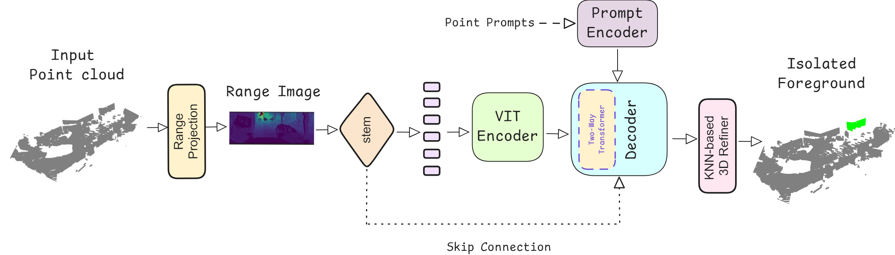

# RangeSAM: Promptable Segmentation of Sparse 3D Point Clouds

RangeSAM is a novel architecture designed for promptable point cloud segmentation, specifically tailored to address the challenges of sparse LiDAR data in outdoor driving scenes. By integrating range-based processing techniques with principles from state-of-the-art 2D promptable segmentation models, RangeSAM effectively handles sparse and irregular LiDAR data while maintaining high segmentation fidelity.

## Code
The code for RangeSAM is pending publication. If you're interested in accessing it, feel free to reach out, and I’ll consider granting access based on the circumstances.

## License

This work is licensed under [CC BY-NC-ND 4.0](https://creativecommons.org/licenses/by-nc-nd/4.0/).
